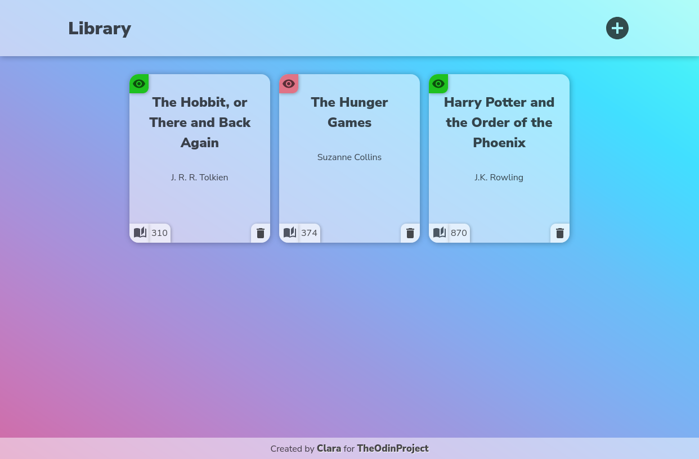
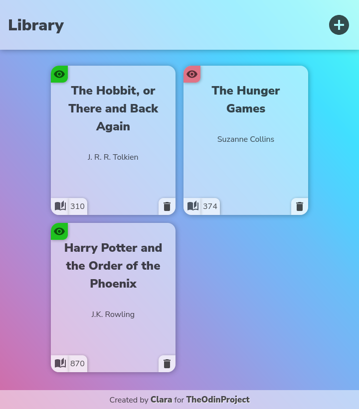
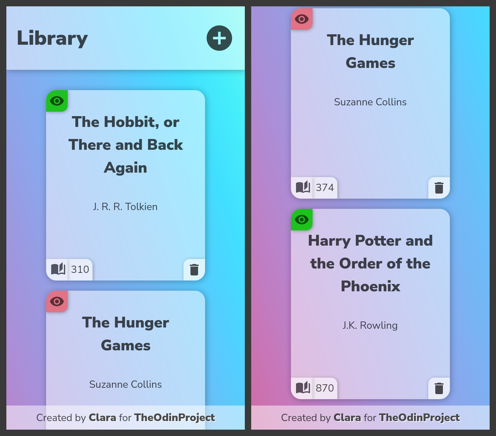

	<h1>Library App
	 
		
		
		
		 
	</h1>
	<h3><b><a href="https://clarasmyth.github.io/library/">View Live Demo</a></b></h3>

## Description

This is a book library app created as part of [TheOdinProject](https://www.theodinproject.com) curriculum.

To see the assignment details - [Click Here](https://www.theodinproject.com/lessons/node-path-javascript-library)

## Built Using

-   HTML5 
-   CSS3 
-   JavaScript 

## Credits

#### Icons

-   [Simple Icons](https://simpleicons.org/)
-   [Material Design Icons](https://materialdesignicons.com/)

## Gallery

#### Home Page

#### Tablet View

#### Mobile View

