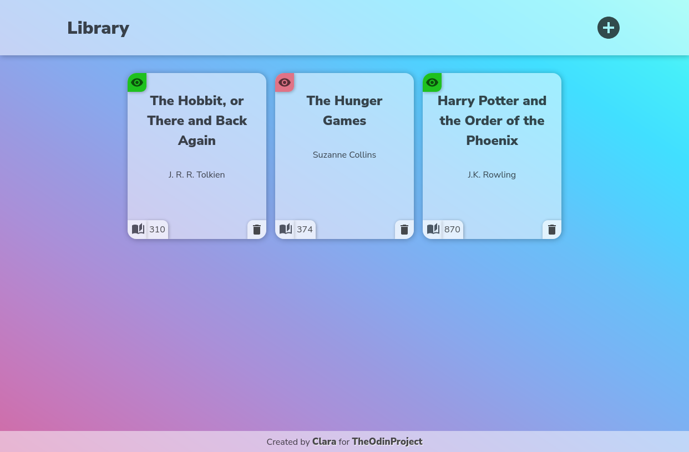
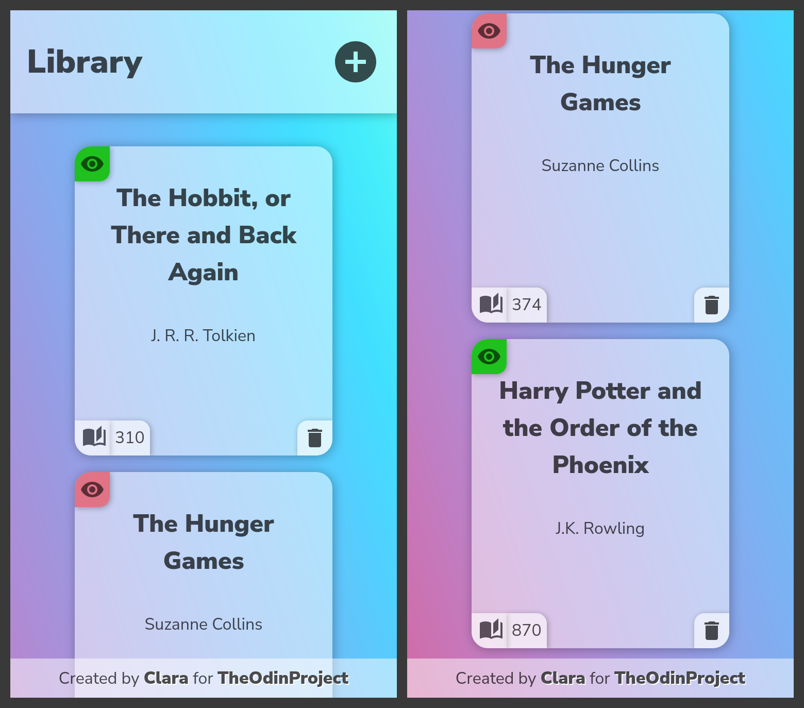

# Library

## Live Version - [Click here!](https://clarasmyth.github.io/library/)

Image on Desktop size screen

Image on Mobile size screen

This is another project created using JavaScript, HTML and CSS. It was created as part of [TheOdinProject](https://www.theodinproject.com/) curriculum.

## Lessons Learned

This project got me more familiar with using arrays and objects. I also learned about prototypal inheritance. 
